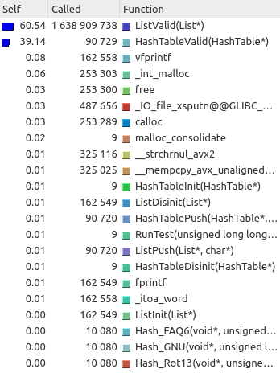

# First of all
> Pardon my English


<script src="https://prnt.sc/rlql5k"></script>

# Abstract
My HashTable is pretty slow, so a bit of optimization will be good for it. I used [Callgrind profile with KCacheGrind][]  to analyse the slowest functions in my code. After that I rewrote this function in clear asm

[Callgrind profile with KCacheGrind]: https://baptiste-wicht.com/posts/2011/09/profile-c-application-with-callgrind-kcachegrind.html

## Analyzing
The profile output before optimization: https://prnt.sc/rlql5k
As you can see, the majority of the time take ```C ListValid()``` function. It is bad! Because, Valid functions won't be in production. Let's delete these functions and run profile. Now our output: https://prnt.sc/rtbup0
Now the majority of time take memory control functions. But, I can't optimzie malloc and free functions. Let's multiply the HashTable code
FROM:
``` C
for (int i = 0; i < number_lines; ++i)
    HashTablePush(&htable, list_of_lines[i].str, Hash);
```
TO:
``` C
for (int i = 0; i < number_lines; ++i)
    HashTablePush(&htable, list_of_lines[i].str, Hash);
for (int i = 0; i < number_lines; ++i)
    HashTablePush(&htable, list_of_lines[i].str, Hash);
for (int i = 0; i < number_lines; ++i)
    HashTablePush(&htable, list_of_lines[i].str, Hash);
for (int i = 0; i < number_lines; ++i)
    HashTablePush(&htable, list_of_lines[i].str, Hash);
```
And from:
``` C
ListNode* new_node = (ListNode*)calloc(1, sizeof(ListNode));
```
To:
``` C
ListNode memory[3330927];

...

static int number_calls = 0;

ListNode* new_node = memory + number_calls;
number_calls++; 
```
Don't forget delete all free's
So, the final attempt for profile: https://prnt.sc/rtcdue
YES!!!! ListPush!

Function pretty easy: 
```C
//////////////////////////////// LIST //////////////////////////////
struct ListNode {
  
  Elem_t data;
  ListNode* next;
};

struct List {
  
  ListNode* first_elem;
  size_t number_nodes;
  ListNode* last_elem;
};
////////////////////////////////////////////////////////////////////

int ListPush(List* list, Elem_t value) {
  static int number_calls = 0;
 
  ListNode* new_node = memory + number_calls++;
 
  //init node
  new_node->data = value;
  new_node->next = NULL;
  
  if (list->number_nodes == 0) {
    list->first_elem = list->last_elem = new_node;
  }
  else {
    list->last_elem->next = new_node;
    list->last_elem = new_node;
  }
  list->number_nodes += 1;
  
  return 0;
}


```
Let's see, assembler version of that function with ```g++ -s list_pointers.cpp```

Don't try to understand all this stuff, just be scared of this code. Pretty ugly, yeah?
```asm
_Z8ListPushP4ListPc:
.LFB17:
	.cfi_startproc
	pushq	%rbp
	.cfi_def_cfa_offset 16
	.cfi_offset 6, -16
	movq	%rsp, %rbp
	.cfi_def_cfa_register 6
	movq	%rdi, -24(%rbp)
	movq	%rsi, -32(%rbp)
	movl	_ZZ8ListPushP4ListPcE12number_calls(%rip), %eax
	leal	1(%rax), %edx
	movl	%edx, _ZZ8ListPushP4ListPcE12number_calls(%rip)
	cltq
	salq	$4, %rax
	movq	%rax, %rdx
	leaq	memory(%rip), %rax
	addq	%rdx, %rax
	movq	%rax, -8(%rbp)
	movq	-8(%rbp), %rax
	movq	-32(%rbp), %rdx
	movq	%rdx, (%rax)
	movq	-8(%rbp), %rax
	movq	$0, 8(%rax)
	movq	-24(%rbp), %rax
	movq	8(%rax), %rax
	testq	%rax, %rax
	jne	.L11
	movq	-24(%rbp), %rax
	movq	-8(%rbp), %rdx
	movq	%rdx, 16(%rax)
	movq	-24(%rbp), %rax
	movq	16(%rax), %rdx
	movq	-24(%rbp), %rax
	movq	%rdx, (%rax)
	jmp	.L12
.L11:
	movq	-24(%rbp), %rax
	movq	16(%rax), %rax
	movq	-8(%rbp), %rdx
	movq	%rdx, 8(%rax)
	movq	-24(%rbp), %rax
	movq	-8(%rbp), %rdx
	movq	%rdx, 16(%rax)
.L12:
	movq	-24(%rbp), %rax
	movq	8(%rax), %rax
	leaq	1(%rax), %rdx
	movq	-24(%rbp), %rax
	movq	%rdx, 8(%rax)
	movl	$0, %eax
	popq	%rbp
	.cfi_def_cfa 7, 8
	ret
	.cfi_endproc
```
Extremely slow, because of the stack manipulation, useful operations...
But, with ```g++ -s list_pointers.cpp -O2``` I got better code, but still with stack and some light brakers.


## New code!
After a hard coding a wrote this function in *clear* assembler. It has documentation, so you can read it carefully
```asm
ListPush:
    # new_node = memory + number_calls++;	
   	movq	_ZZ8ListPushP4ListPcE12number_calls(%rip), %rax
	leal	1(%rax), %edx
	movl	%edx, _ZZ8ListPushP4ListPcE12number_calls(%rip)
	salq	$4, %rax
	leaq	memory(%rip), %rdx
	addq	%rax, %rdx

    # new_node->data = value;
    # new_node->next = NULL;
	movq	%rsi, (%rdx)
	movq	$0, 8(%rdx)    
        
    # if (list->number_nodes == 0) {
	movq	8(%rdi), %rax
	testq	%rax, %rax	
    	jne	.L11
    
    # list->number_nodes += 1;	
	addq    $1, %rax
	movq	%rax, 8(%rdi)

    # list->first_elem = list->last_elem = new_node;
	movq	%rdx, 16(%rdi)
	movq	%rdx, (%rdi)
	
    	xorl	%eax, %eax
	ret
.L11:
    # list->number_nodes += 1;	
	addq    $1, %rax
	movq	%rax, 8(%rdi)

    # list->last_elem->next = new_node;
    # list->last_elem = new_node;    
    	movq	16(%rdi), %rax
	movq	%rdx, 8(%rax)
	movq	%rdx, 16(%rdi)

    	xorl	%eax, %eax
	ret
```
Fabulous
Let't check the speed of this function!
https://prnt.sc/rtfy1e
WOW, from 12.19% of all time to 5.46%. 
### This means x2 optimization for function and 9% optimization for all code
But, we have HashTablePush
Optimize it: https://prnt.sc/rth12t
From 13.37 to 8.67. This means 35% optimization

Good result, Ded? I think, уд(3) there уд() - function that return number in binary representation
