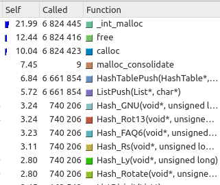
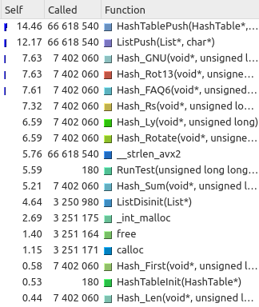

# First of all
> Pardon my English

# Abstract
In this article I give the example of assembler optimization of the C code. 

Code is HashTable. The algorithm is:
1. Read items(words) from dict
2. For each item compute hash
3. Add item in the hash table
4. If item already exist in the hash table, bound it with the last added item in this cell

The 4 point can be visualized with this picture


I used [Callgrind profile with 	KCacheGrind][]  to analyse the slowest functions in my code. After that I rewrote this function in clear asm

[Callgrind profile with KCacheGrind]: https://baptiste-wicht.com/posts/2011/09/profile-c-application-with-callgrind-kcachegrind.html

## Analyzing
The profile output before optimization: 


As we can see, the majority of the time take ```C ListValid()``` function. It is bad! Because, Valid functions won't be in production. Let's delete these functions and run profile. Now our output:



Now the majority of time take memory control functions. But, I can't optimzie malloc and free functions. Let's multiply the HashTable code
FROM:
``` C
  RunTest(Hash_First,  list_of_lines, number_lines, name_of_result_files[0]);
  RunTest(Hash_Sum,    list_of_lines, number_lines, name_of_result_files[1]);
  RunTest(Hash_Len,    list_of_lines, number_lines, name_of_result_files[2]);
  RunTest(Hash_Rotate, list_of_lines, number_lines, name_of_result_files[3]);
  RunTest(Hash_GNU,    list_of_lines, number_lines, name_of_result_files[4]);
  RunTest(Hash_Rot13,  list_of_lines, number_lines, name_of_result_files[5]);
  RunTest(Hash_FAQ6,   list_of_lines, number_lines, name_of_result_files[6]);
  RunTest(Hash_Ly,     list_of_lines, number_lines, name_of_result_files[7]);
  RunTest(Hash_Rs,     list_of_lines, number_lines, name_of_result_files[8]);
```
TO:
``` C
for (int i = 0; i < 100; ++i) {
  RunTest(Hash_First,  list_of_lines, number_lines, name_of_result_files[0]);
  RunTest(Hash_Sum,    list_of_lines, number_lines, name_of_result_files[1]);
  RunTest(Hash_Len,    list_of_lines, number_lines, name_of_result_files[2]);
  RunTest(Hash_Rotate, list_of_lines, number_lines, name_of_result_files[3]);
  RunTest(Hash_GNU,    list_of_lines, number_lines, name_of_result_files[4]);
  RunTest(Hash_Rot13,  list_of_lines, number_lines, name_of_result_files[5]);
  RunTest(Hash_FAQ6,   list_of_lines, number_lines, name_of_result_files[6]);
  RunTest(Hash_Ly,     list_of_lines, number_lines, name_of_result_files[7]);
  RunTest(Hash_Rs,     list_of_lines, number_lines, name_of_result_files[8]);
}
```
And from calloc memory:
``` C
ListNode* new_node = (ListNode*)calloc(1, sizeof(ListNode));
```
To fixed memory:
``` C
ListNode memory[3330927]; // 3330927 - constant == number of ListPush calls
			  //           was calculated by static variable
...

static int number_calls = 0;

ListNode* new_node = memory + number_calls;
number_calls++; 
```
Don't forget delete all free's!
So, the final attempt for profile:



**Time:** 9.05
YES!!!! ListPush!

Function pretty easy: 
```C
//////////////////////////////// LIST //////////////////////////////
struct ListNode {
  
  Elem_t data;
  ListNode* next;
};

struct List {
  
  ListNode* first_elem;
  size_t number_nodes;
  ListNode* last_elem;
};
////////////////////////////////////////////////////////////////////

int ListPush(List* list, Elem_t value) {
  static int number_calls = 0;
 
  ListNode* new_node = memory + number_calls++;
 
  //init node
  new_node->data = value;
  new_node->next = NULL;
  
  if (list->number_nodes == 0) {
    list->first_elem = list->last_elem = new_node;
  }
  else {
    list->last_elem->next = new_node;
    list->last_elem = new_node;
  }
  list->number_nodes += 1;
  
  return 0;
}


```
Let's see, assembler version of that function with ```g++ -s list_pointers.cpp```

Don't try to understand all this stuff, just be scared of this code. Pretty ugly, yeah?
```asm
_Z8ListPushP4ListPc:
.LFB17:
	.cfi_startproc
	pushq	%rbp
	.cfi_def_cfa_offset 16
	.cfi_offset 6, -16
	movq	%rsp, %rbp
	.cfi_def_cfa_register 6
	movq	%rdi, -24(%rbp)
	movq	%rsi, -32(%rbp)
	movl	_ZZ8ListPushP4ListPcE12number_calls(%rip), %eax
	leal	1(%rax), %edx
	movl	%edx, _ZZ8ListPushP4ListPcE12number_calls(%rip)
	cltq
	salq	$4, %rax
	movq	%rax, %rdx
	leaq	memory(%rip), %rax
	addq	%rdx, %rax
	movq	%rax, -8(%rbp)
	movq	-8(%rbp), %rax
	movq	-32(%rbp), %rdx
	movq	%rdx, (%rax)
	movq	-8(%rbp), %rax
	movq	$0, 8(%rax)
	movq	-24(%rbp), %rax
	movq	8(%rax), %rax
	testq	%rax, %rax
	jne	.L11
	movq	-24(%rbp), %rax
	movq	-8(%rbp), %rdx
	movq	%rdx, 16(%rax)
	movq	-24(%rbp), %rax
	movq	16(%rax), %rdx
	movq	-24(%rbp), %rax
	movq	%rdx, (%rax)
	jmp	.L12
.L11:
	movq	-24(%rbp), %rax
	movq	16(%rax), %rax
	movq	-8(%rbp), %rdx
	movq	%rdx, 8(%rax)
	movq	-24(%rbp), %rax
	movq	-8(%rbp), %rdx
	movq	%rdx, 16(%rax)
.L12:
	movq	-24(%rbp), %rax
	movq	8(%rax), %rax
	leaq	1(%rax), %rdx
	movq	-24(%rbp), %rax
	movq	%rdx, 8(%rax)
	movl	$0, %eax
	popq	%rbp
	.cfi_def_cfa 7, 8
	ret
	.cfi_endproc
```
Extremely slow, because of the stack manipulation, useful operations...
But, with ```g++ -s list_pointers.cpp -O2``` I got better code, but still with stack and some light brakers.


## New code!
So, what you should do to rewrite code in assembler. My solution:
1. Make assembler listing for desired file wtih ```g++ -s list_pointers.cpp -O0```
2. Just copy desired function in new file, list_push.s in my example. It was assembled with [mangling][]. It is okey, because we will write ```extern```, which, by default, means ```extern "C++"```, which means C++ names. If you want C type names, write in the 3 point ```extern "C"``` and rename function in the assembler listing.
3. In function declaration in the .cpp file, where desired function lived, wrtie: ``` extern ListPush(...); ```. And delete function definition
4. Compile: ```g++ list_pointers.cpp list_push.s -O2```
5. Now, if all works, with http://godbolt.com optimize you .s file

[mangling]: https://en.wikipedia.org/wiki/Name_mangling

After a hard coding I wrote this function in *clear* assembler. It has documentation, so you can read it carefully
```asm
ListPush:
    # new_node = memory + number_calls++;	
   	movq	_ZZ8ListPushP4ListPcE12number_calls(%rip), %rax
	leal	1(%rax), %edx
	movl	%edx, _ZZ8ListPushP4ListPcE12number_calls(%rip)
	salq	$4, %rax
	leaq	memory(%rip), %rdx
	addq	%rax, %rdx

    # new_node->data = value;
    # new_node->next = NULL;
	movq	%rsi, (%rdx)
	movq	$0, 8(%rdx)    
        
    # if (list->number_nodes == 0) {
	movq	8(%rdi), %rax
	testq	%rax, %rax	
    	jne	.L11
    
    # list->number_nodes += 1;	
	addq    $1, %rax
	movq	%rax, 8(%rdi)

    # list->first_elem = list->last_elem = new_node;
	movq	%rdx, 16(%rdi)
	movq	%rdx, (%rdi)
	
    	xorl	%eax, %eax
	ret
.L11:
    # list->number_nodes += 1;	
	addq    $1, %rax
	movq	%rax, 8(%rdi)

    # list->last_elem->next = new_node;
    # list->last_elem = new_node;    
    	movq	16(%rdi), %rax
	movq	%rdx, 8(%rax)
	movq	%rdx, 16(%rdi)

    	xorl	%eax, %eax
	ret
```
1. Deleted all stack manipulation
2. Deleted some strange expressions: 
```asm	movq	%rax, -8(%rbp)
	movq	-8(%rbp), %rax 
```
3. Less jmp's
4. And some small one's: ```movl $0, %eax -> xorl %eax, %eax```

Fabulous
Let't check the speed of this function!
https://prnt.sc/rtfy1e
WOW, from 12.19% of all time to 5.46%. 
### This means x2 optimization for function and 9% optimization for all code
But, we have HashTablePush
Optimize it: https://prnt.sc/rth12t
From 13.37 to 8.67. This means 35% optimization
